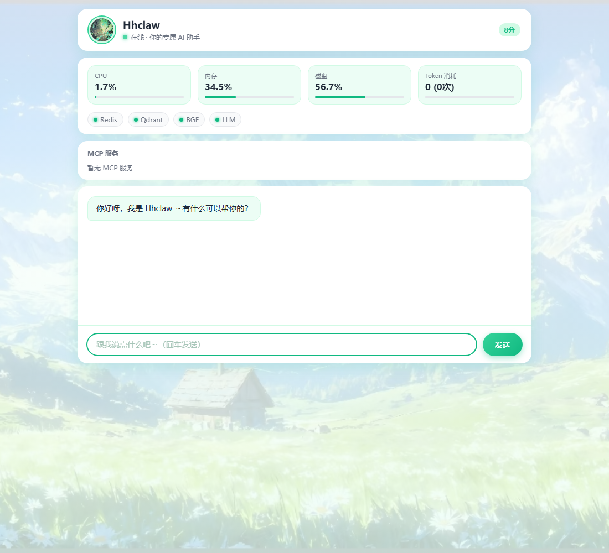
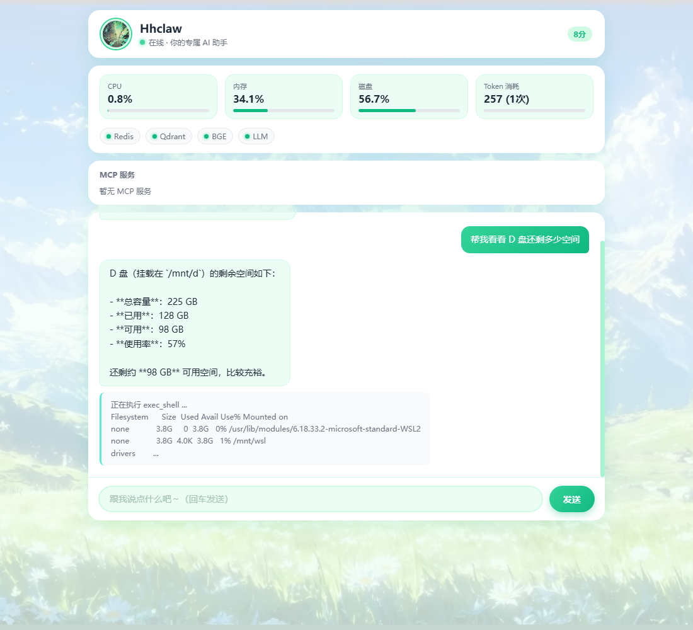
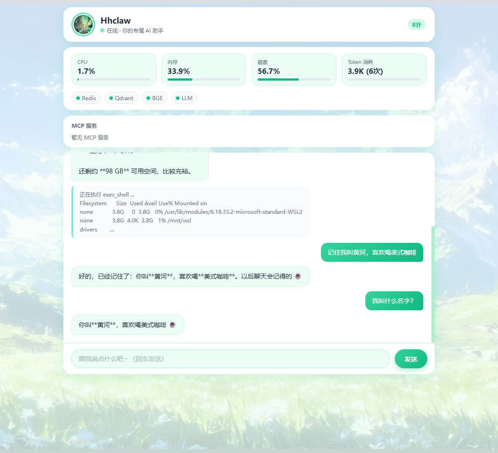
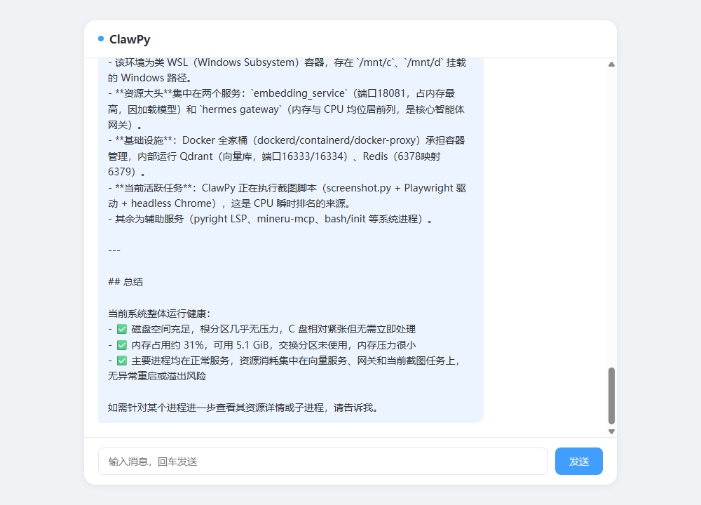
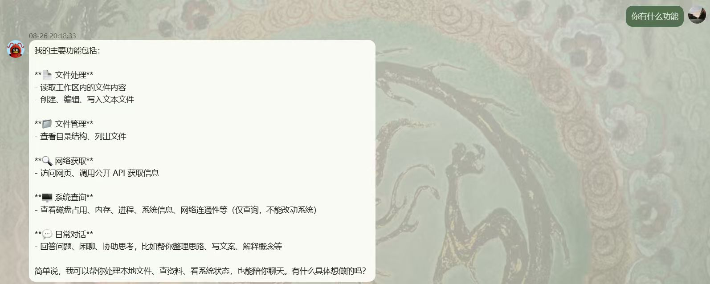
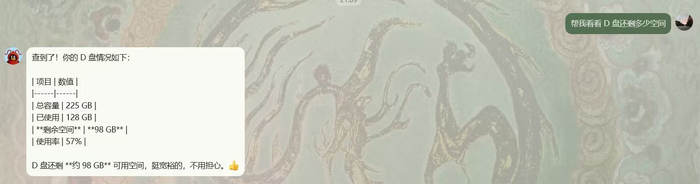
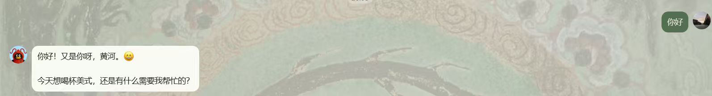
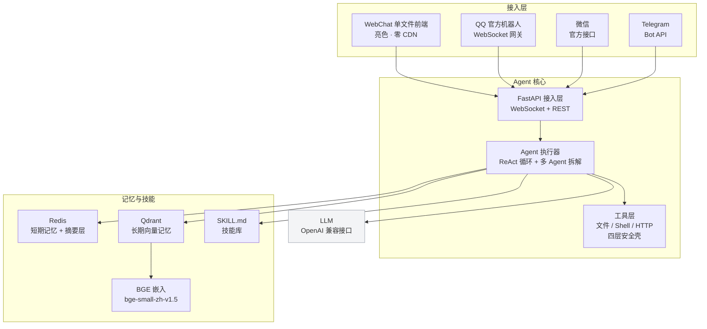

# Hhclaw

> 个人专属 AI 助手 —— OpenClaw 的 Python 升级版，全 Python 技术栈，本地运行。


一个常驻本地的 Python 进程：**聊天界面 / QQ / 微信 / Telegram 当遥控器，LLM 当大脑，工具当手脚，向量记忆当长期记忆，SKILL.md 当技能库，定时器当闹钟。**

相比原版 OpenClaw 的升级点：

| OpenClaw 原版 | Hhclaw 升级版 |
|---|---|
| 记忆 = 本地 Markdown 文件，纯文件查找 | 向量 RAG 记忆（Qdrant + BGE，语义检索「我上周说过啥」） |
| Node.js | 全 Python（FastAPI，可维护、可写进简历） |
| 单 Agent 为主 | 多 Agent 协作（主 Agent 拆解 + 子 Agent 并发） |
| WhatsApp / Telegram（国外平台） | QQ / 微信 / Telegram（国内平台全覆盖） |
| 英文生态 | 中文友好（BGE 本来就是中文强） |

## 界面预览（真实运行截图）

### 监控面板 + 对话

启动后打开 http://localhost:8000，顶部实时展示系统资源（CPU / 内存 / 磁盘 / Token 消耗）与依赖服务健康灯（Redis / Qdrant / BGE / LLM）：



### 工具调用

问一句「帮我看看 D 盘还剩多少空间」，Agent 自动调用 shell 工具执行 `df`，并把原始输出转成易读的结论：



### 记忆

「记住我叫黄河，喜欢喝美式咖啡」之后，再问「我叫什么」，它能从向量记忆里检索出来：



### 多 Agent 协作

复杂任务「全面检查系统状态」被主 Agent 拆成多个子任务并发执行，再汇总成一份带表格的报告：



### 多平台实测（以 QQ 为例）

同一个大脑，QQ / 微信 / Telegram 都能当遥控器。在 QQ 上问「你有什么功能」：



问「帮我看看 D 盘还剩多少空间」，它直接调 shell 工具执行 `df`，把结果转成表格：



更关键的——WebChat 里说过「我叫黄河、喜欢美式」，换到 QQ 上再聊，它也能从同一套向量记忆里召回：



## 架构



## 核心特性

| 能力 | 实现 |
|---|---|
| 流式聊天 | FastAPI + WebSocket，打字机效果 |
| 实时监控面板 | `/api/status` 展示 CPU / 内存 / 磁盘 / Token / 依赖服务健康 / uptime |
| 工具调用 | 文件 / Shell / HTTP，四层安全壳（结构化调用 + 白名单 + 路径校验 + 超时） |
| 三层记忆 | Redis 短期（20 轮）→ 摘要层（每 10 轮）→ Qdrant 长期（BGE 向量检索） |
| 技能库 | SKILL.md frontmatter + 关键词路由（中文顺序匹配） |
| 心跳调度 | APScheduler 定时自主唤醒 |
| 多 Agent | 主 Agent 拆解 + 子 Agent 并发（dispatch 接口，可换 LangGraph） |
| 多平台接入 | QQ / 微信 / Telegram 三端统一接入（官方接口，无 hook 逆向），单聊 + 群聊 @ |

## 快速开始

### 1. 配置环境变量

```bash
export AGICTO_API_KEY=<你的 LLM key>            # LLM 接入（OpenAI 兼容接口）
export QQ_APP_ID=<你的 QQ 机器人 AppID>          # QQ（可选）
export QQ_APP_SECRET=<你的 QQ 机器人 AppSecret>   # QQ（可选）
export WX_APP_ID=<你的微信 AppID>                # 微信（可选）
export WX_APP_SECRET=<你的微信 AppSecret>         # 微信（可选）
export TG_BOT_TOKEN=<你的 Telegram Bot Token>     # Telegram（可选）
```

### 2. 安装依赖并启动

```bash
uv sync                                       # 安装依赖
uv run uvicorn app.main:app --host 0.0.0.0 --port 8000
```

浏览器打开 http://localhost:8000 即可用 WebChat 对话。

### 3. 依赖服务（记忆系统需要）

| 服务 | 端口 | 说明 |
|---|---|---|
| Redis | 6378 | 短期记忆 + 摘要 |
| Qdrant | 16333 | 长期向量记忆 |
| BGE 嵌入 | 18081 | bge-small-zh-v1.5，512 维 |

> 端口均可用环境变量覆盖：`HHCLAW_REDIS_URL` / `HHCLAW_QDRANT_URL` / `HHCLAW_BGE_URL`。
> 心跳默认关闭，需要时 `HHCLAW_HEARTBEAT_ENABLED=true` + `HHCLAW_HEARTBEAT_INTERVAL` 开启。

## 多平台接入（QQ / 微信 / Telegram）

三个平台都通过官方接口接入，合规稳定，无需 hook 逆向，共用一个大脑和一套记忆。

| 平台 | 接入方式 | 说明 |
|---|---|---|
| QQ | 腾讯 QQ 开放平台（q.qq.com）WebSocket 网关 | 单聊 C2C + 群聊 @ |
| 微信 | 微信官方接口（公众号 / 企业微信） | 消息回调 |
| Telegram | Telegram Bot API（官方 HTTP 接口） | 长轮询 / Webhook |

### QQ 开通流程

1. 登录 [q.qq.com](https://q.qq.com) → 个人主体注册（邮箱 + 实名）
2. 创建机器人，拿到 **AppID** 和 **AppSecret**
3. 开发设置里把「事件订阅方式」选为 **WebSocket**
4. 配置沙箱（沙箱单聊 QQ 号 = 你自己的号），沙箱环境无需审核和公网 IP 即可测试

### 环境变量

| 变量 | 默认值 | 说明 |
|---|---|---|
| `QQ_APP_ID` | 空 | QQ 机器人 AppID |
| `QQ_APP_SECRET` | 空 | QQ 机器人 AppSecret |
| `QQ_API_BASE` | `https://sandbox.api.sgroup.qq.com` | QQ 沙箱环境；正式环境用 `https://api.sgroup.qq.com` |
| `QQ_INTENTS` | `1<<25`（33554432） | QQ 订阅事件：单聊 + 群聊 @ |
| `WX_APP_ID` / `WX_APP_SECRET` | 空 | 微信官方接口凭据 |
| `TG_BOT_TOKEN` | 空 | Telegram Bot Token（@BotFather 获取） |

### 工作原理

各平台适配器把消息统一收成同一种格式 → 记忆检索 + 技能路由 + Agent 循环 → 再投递回对应平台。以 QQ 为例：拿 access_token → 连 WebSocket 网关 → Identify 鉴权 → 收消息事件 → Agent 处理 → 通过 HTTP API 发消息回 QQ，群聊需 @ 才应答。

## 技术栈

Python 3.11 · FastAPI · WebSocket · 手写 ReAct 循环 · Redis · Qdrant · BGE · APScheduler · httpx · websockets · Playwright

## 项目结构

```
hhclaw/
├── app/
│   ├── main.py        # 接入层（WebChat WebSocket）+ 消息处理编排
│   ├── status.py      # 系统状态监控（/api/status + MCP 注册表）
│   ├── qqbot.py       # QQ 官方机器人接入（WebSocket 网关 + 心跳 + 收发）
│   ├── wechatbot.py   # 微信官方接口接入
│   ├── tgbot.py       # Telegram Bot API 接入
│   ├── agent.py       # ReAct 循环（含终止条件）
│   ├── tools.py       # 工具层 + 四层安全壳
│   ├── memory.py      # 三层记忆（Redis + Qdrant/BGE）
│   ├── skills.py      # SKILL.md 技能路由
│   ├── multiagent.py  # 多 Agent 协作
│   ├── scheduler.py   # 心跳调度
│   ├── llm.py         # LLM 流式调用 + token 统计
│   └── config.py      # 配置（环境变量）
├── skills/            # 技能库（code-review 等）
├── static/index.html  # 单文件前端（亮色、零 CDN、含监控面板）
├── docs/screenshots/  # README 截图
└── scripts/           # 测试 + 截图脚本
```

## 设计文档

完整设计见仓库 `docs/` 目录与《专属AI助手_详细设计说明书》。
